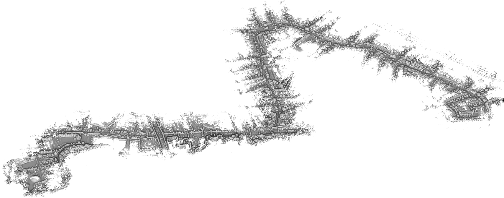
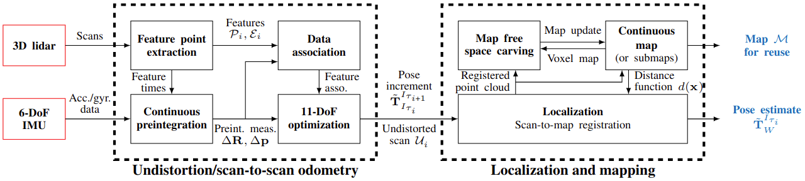

# 2Fast-2Lamaa

This repository contains our open-source implementation of __2Fast-2Lamaaa__, a lidar-inertial mapping and localisation framework for large-scale environments.



__If you are looking to use the undistortion-related code from our IROS publication, or the first version of 2Fast-2Lamaa, please refer to the `old` branch.__

### Abstract 

2Fast-2Lamaa stands for Fast Field-based Agent-Subtracted Truly coupled Lidar Localisation And Mapping with Accelerometer and Angular-rate.
In other words, it performs localisation and mapping with a lidar and an IMU (_accelerometer and angular-rate_) using a Gaussian-Process-based distance field, and allows for dynamic object removal online or offline (_agent-subtracted_).
The first key component of the proposed approach is the optimization-based undistortion of the lidar scans that leverages continuous IMU preintegration to model the system's pose at every lidar point timestamp.
The continuous trajectory of the system over a span of 100-200ms is parameterized solely by the initial conditions at the beginning of the scan (linear velocity and gravity orientation) and the IMU biases.
This represents only eleven state variables that are estimated by minimizing point-to-line and point-to-plane distances between lidar-extracted features without relying on previous estimates, resulting in a prior-less motion-distortion correction strategy.
As the proposed undistortion strategy performs local state estimation, it directly provides scan-to-scan odometry estimates.
To enforce geometric consistency over longer periods of time, the undistorted scans are used for scan-to-map registration.
The proposed map representation relies on Gaussian Processes to provide a continuous distance field, thus allowing point-to-surface distance queries anywhere in space.
The poses of the undistorted lidar scans are corrected by minimizing such distances in a non-linear least-squares optimization.
For odometry and mapping, the map is built incrementally in real-time, whereas for pure localization, it reuses existing maps.
The incremental map building also includes mechanisms to remove dynamic objects from the scene.
We extensively benchmark 2Fast-2Lamaa using 250km (over 10h) of public and self-collected datasets from both automotive and handheld systems.
2Fast-2Lamaa displays state-of-the-art performance across a wide range of challenging scenarios, with odometry and localization errors down to 0.27% and 0.06m, respectively.



A thourough presentation and performance analysis of 2Fast-2Lamaa is available in our [paper's preprint](https://arxiv.org/abs/2410.05433).


Corresponding contributor: le.gentil.cedric@gmail.com

## Disclaimer

This code is provided as it is. It is research code that is not necessarily optimized for maintainability.
We open-sourced this work for the benefit of the robotics community and we are open to suggestions/collaborations to improve this pipeline.

## Citing

If you are using this framework or part of it please cite our work as shown at the bottom of this page

## Installation

### Dependencies

The following dependencies are required to build the package:
- ROS2
- Ceres
- Eigen

Please refer to the [ROS2 installation guide with Ubuntu 24.04](https://docs.ros.org/en/jazzy/Installation/Ubuntu-Install-Debs.html) for the installation of ROS2.
The other dependencies can be installed using the following command:
```bash
sudo apt install libceres-dev libeigen3-dev
```
(if the default Ceres version is too old, you need to install Ceres 2.2 from source)

### Building

To build the package, clone the repository in your ROS2 workspace and build it using colcon (if you don't have a workspace yet, create `~/ros2_ws/src`):
```bash
cd /path/to/your/workspace/src
git clone https://github.com/UTS-RI/2fast2lamaa.git
cd ..
colcon build --packages-select ffastllamaa
source install/setup.bash
```

## Running

2Fast-2Lamaa is implemented as a ROS2 package named `ffastllamaa`.
Accordingly, you need your data to be in ROS2 bag format to run the package.
The lidar and IMU data should be `pointcloud2` and `imu` messages, respectively.
You need to know the extrinsic calibration between the lidar and the IMU (the data should also be synchronised ideally)
Incorrect knowledge of the extrinsic calibration or bad synchronization will result in poor localisation and mapping performance.

As aforementioned, the core of 2Fast-2Lamaa is made of two main modules/nodes that are launched together via a launch file:
- `lidar_scan_odometry`, the undistortion and dynamic object filtering node: it uses the IMU measurements to undistort the lidar scans in an optimization-based formulation
- `gp_map`, the localisation and mapping node: it uses the undistorted scans to perform localisation within a map (global or topometric) that can be built online of mapping, or provided for localisation only.

Thus, 2Fast-2Lamaa can be used in different modes: odometry/mapping or pure localisation.
Both these modes can use a global map or a topometric map (set of submaps topologically linked).
The mode and map style selection is done through node parameters (detailed below) that can be provided via the launch file.

Additionally, this repository also provides scripts/executables for:
- Offline dynamic object removal from 2Fast-2Lamaa-built maps
- Offline loop closure detection and pose graph optimisation
- Boreas dataset conversion towards ROS2 bags


### Launching 2Fast-2Lamaa


Then you can run the package using the following command:
```bash
ros2 launch ffastllamaa <launch_file.launch.py>
```

In another terminal, you can play your ROS2 bag using:
```bash
ros2 bag play <your_bag_file>
```


The tunable parameter of 2Fast-2Lamaa (and its two modules/nodes) are detailed in the following subsection.
For convenience, we provide launch files (based on topometric maps) for the different dataset we used in our paper:
- `boreas_odometry_old.launch.py` and `boreas_localization_old.launch.py` for the [Boreas dataset](https://www.boreas.utias.utoronto.ca).
- `boreas_odometry.launch.py` and `boreas_localization.launch.py` for the newer Boreas sequences (to be released soon) refered as "self-collected" in the paper.
- `os1_odometry.launch.py` and `os1_localization.launch.py` for the [Newer College dataset](https://ori-drs.github.io/newer-college-dataset/stereo-cam/) (stereo cam).
- `vbr_odometry.launch.py` for the [VBR SLAM dataset](https://www.rvp-group.net/slam-dataset.html).


We also provide two other launch files for the Livox Mid360 lidar (`mid360_odometry.launch.py`) and the Ouster OS0 lidar (`os0_odometry.launch`) as used in the [extension of the Newer College datset](https://ori-drs.github.io/newer-college-dataset/multi-cam/) (multi cam).
Note that these last two are provided for convenience but have not been tested thoroughly (and the parameters are not tuned).


## lidar_odometry node topics and parameters

The most important step to run 2Fast-2Lamaa is to provide the correct topic remapping for the lidar and IMU data, and to set the extrinsic calibration between the two sensors.

#### Topics and Frames

| Input Topics | | |
|-------|------|-------------|
| __Topic__ | __Type__ | __Description__ |
| `/imu/acc` | `sensor_msgs/msg/Imu` | Accelerometer measurements from IMU |
| `/imu/gyr` | `sensor_msgs/msg/Imu` | Gyroscope measurements from IMU |
| `/lidar_raw_points` | `sensor_msgs/msg/PointCloud2` | Raw LiDAR point cloud input |


| Output Topics | | |
| -------|------|-------------|
| __Topic__ | __Type__ | __Description__ |
| `/undistortion_delta_transform` | `geometry_msgs/msg/TransformStamped` | Incremental transform between consecutive scans |
| `/undistortion_pose` | `geometry_msgs/msg/TransformStamped` | Current pose in odom frame |
| `/end_of_scan_odom` | `nav_msgs/msg/Odometry` | Full odometry message with pose and twist at end of scan |
| `/end_of_scan_odom_twist` | `geometry_msgs/msg/TwistStamped` | Velocity estimate at end of scan |
| `/lidar_scan_undistorted` | `sensor_msgs/msg/PointCloud2` | Motion-compensated point cloud |
| `/lidar_scan_undistorted_dense` | `sensor_msgs/msg/PointCloud2` | Dense motion-compensated point cloud (only if `dense_pc_output` is enabled) |

| Published TF Frames | | |
|--------------|-------------|-------------|
| __Parent Frame__ | __Child Frame__ | __Description__ |
| `map` | `odom` | Map to odom correction (if `/odom_map_correction` is received from the `gp_map` node) |
| `odom` | `lidar` | Current LiDAR pose estimate |
| `odom` | `lidar_head` | LiDAR head pose with velocity information |


#### Required Parameters

| Parameter | Type | Description |
|-----------|------|-------------|
| `calib_px` | double | X-component of translation extrinsic calibration (meters) |
| `calib_py` | double | Y-component of translation extrinsic calibration (meters) |
| `calib_pz` | double | Z-component of translation extrinsic calibration (meters) |
| `calib_rx` | double | X-component of rotation extrinsic calibration (radians) |
| `calib_ry` | double | Y-component of rotation extrinsic calibration (radians) |
| `calib_rz` | double | Z-component of rotation extrinsic calibration (radians) |

The extrinsic calibration parameters define the rigid transform from the IMU frame to the LiDAR frame.
The rotation is expressed as a rotation vector (axis-angle representation).
If you have the transform `T_imu_lidar`, that transforms points from the LiDAR frame to the IMU frame as `p_imu = T_imu_lidar * p_lidar`, then the parameters are defined as:
- `calib_p = T_imu_lidar[0,:3]`
- `calib_r = Log(T_imu_lidar[0:3,0:3])` with `Log` the SO(3) logarithm map.

Here is a python snippet to compute these parameters from a given `T_imu_lidar`:
```python
import numpy as np
from scipy.spatial.transform import Rotation as R

T_imu_lidar = np.array([[...],  # 4x4 transformation matrix
                         [...],
                         [...],
                         [...]])
calib_p = T_imu_lidar[0:3, 3]
R_imu_lidar = T_imu_lidar[0:3, 0:3]
rvec = R.from_matrix(R_imu_lidar).as_rotvec()
calib_rx, calib_ry, calib_rz = rvec
```

#### Algorithm Parameters

| Lidar frontend parameters |  |  |  |
|---------------------|--|--|--|
| __Parameter__ | __Type__ | __Default__ | __Description__ |
| `min_range` | double | `1.0` | Minimum point range to consider (meters) |
| `max_range` | double | `150.0` | Maximum point range to consider (meters) |
| `min_feature_dist` | double | `0.05` | Minimum distance for feature detection (meters) |
| `max_feature_dist` | double | `0.5` | Maximum distance for feature detection (meters) |
| `max_feature_range` | double | `150.0` | Maximum range for feature extraction (meters) |
| `feature_voxel_size` | double | `0.3` | Voxel size for (planar) feature downsampling (meters) |
| `planar_only` | bool | `false` | Use only planar features (ignore edge features) |
| `point_cloud_scale` | double | `1.0` | Scale factor applied to incoming point cloud coordinates in case there is a discrepancy in scale or unit between the LiDAR data and the map |
| `unsorted_pc` | bool | `false` | Indicates if incoming point cloud is unsorted (not ordered by time). If true, the algorithm will handle the point cloud accordingly given a bit more computation burden |
| `broken_channels` | string | `""` | Comma-separated list of LiDAR channels to ignore (e.g., "0,5,10") |
| `point_time_multiplier` | double | `1e-9` | Multiplier to convert point timestamps to seconds (default assumes nanoseconds) |
| `absolute_time` | bool | `false` | Whether point timestamps are absolute (true) or relative to scan start (false) |

| IMU processing parameters |  |  |  |
|---------------------|--|--|--|
| __Parameter__ | __Type__ | __Default__ | __Description__ |
| `acc_in_m_per_s2` | bool | `true` | Whether accelerometer data is in m/s² (false means in g units) |
| `invert_imu` | bool | `true` | Invert IMU measurements (for different mounting orientations) |

| Back-end/estimation parameters |  |  |  |
|---------------------|--|--|--|
| __Parameter__ | __Type__ | __Default__ | __Description__ |
| `loss_function_scale` | double | `1.0` | Scale parameter for robust loss function |
| `max_associations_per_type` | int | `1000` | Maximum number of feature associations per type |
| `low_latency` | bool | `true` | Putting to false would compute the odometry and undistortion only every second scan |
| `state_freq` | double | `200.0` | Imu state frequency (Hz), it does not really matter |
| `g` | double | `9.80` | Gravitational acceleration magnitude (m/s²) |
| `dense_pc_output` | bool | `false` | Enable publishing of dense undistorted point cloud |


## gp_map node topics and parameters

The `gp_map` node builds and maintains a Gaussian Process-based distance field map from incoming point clouds. It can operate in two modes: **mapping** (building a new map) or **localization** (localizing against an existing map). The node supports optional scan-to-map registration and key-framing for efficient map updates.

__For odometry/mapping__, the `localization_only` parameter should be set to `false` (default).
In that case, the parameter `submap_length` can be set to a positive value to enable topometric mapping (submap-based) or kept to a negative value to build a global map.

__For pure localization__, the `localization_only` parameter should be set to `true`.
In that case, the parameter `using_submaps` can be set to `true` to enable topometric localization (submap-based) or kept to `false` to use a global map.


#### Topics

| Output Topics | | |
|-------|------|-------------|
| __Topic__ | __Type__ | __Description__ |
| `/map` | `sensor_msgs/msg/PointCloud2` | Current map point cloud (published periodically based on `map_publish_period`) |
| `/odom_map_correction` | `geometry_msgs/msg/TransformStamped` | Transform correction from odom frame to map frame (published during registration) |
| `/scan_to_map_pose` | `geometry_msgs/msg/TransformStamped` | Current scan pose in map frame |

#### Services

| Service | Type | Description |
|---------|------|-------------|
| `/query_dist_field` | `ffastllamaa/srv/QueryDistField` | Query distance values at specified 3D points in the distance field map |

#### Parameters

| Required Parameters | | |
|-----------|------|-------------|
| __Parameter__ | __Type__ | __Description__ |
| `voxel_size` | double | Voxel size for the distance field map (meters) |
| `neighbourhood_size` | int | Number of neighboring cells to consider for distance field computation |
| `with_init_guess` | bool | Whether to use time-synchronized pose input as initial guess for registration (should be `true` for normal 2fast2lamaa operation) |
| `map_path` | string | Path to directory for saving/loading map data and trajectory |
| `min_range` | double | Minimum range of points to consider from sensor (meters) |

__In localization-only mode with 2Fast-2Lamaa-made maps, the voxel_size parameter should match the one used during mapping.__

| Registration Parameters |  |  |  |
|---------------------|--|--| --|
| __Parameter__ | __Type__ | __Default__ | __Description__ |
| `localization_only` | bool | `false` | Enable localization-only mode (no map building, requires existing map) |
| `register` | bool | `true` | Enable scan-to-map registration (if false, uses dead-reckoning from input poses) |
| `use_temporal_weights` | bool | `false` | Apply temporal weighting to map points for registration (recent points weighted higher) |
| `register_with_approximate_field` | bool | `false` | Use approximate distance field queries for faster registration (point-to-point, no GP distance field) |
| `loss_function_scale` | double | `0.5` | Scale parameter for robust loss function in registration optimization |
| `voxel_size_factor_for_registration` | double | `5.0` | Multiplier for `voxel_size` to compute downsampling size for registration |
| `max_num_pts_for_registration` | int | `4000` | Maximum number of points to use for scan-to-map registration |
| `use_edge_field` | bool | `true` | Enable separate edge feature distance field (sometimes it seems to converge faster) |
| `key_framing` | bool | `false` | Enable key-frame-based map updates (skip scans that don't meet criteria) |
| `key_framing_dist_thr` | double | `1.0` | Distance threshold for creating new keyframe (meters) |
| `key_framing_rot_thr` | double | `0.1` | Rotation threshold for creating new keyframe (radians) |
| `key_framing_time_thr` | double | `1.0` | Time threshold for creating new keyframe (seconds) |

| Mapping and free space carving parameters |  |  |  |
|---------------------|--|--|--|
| __Parameter__ | __Type__ | __Default__ | __Description__ |
| `max_range` | double | `1000.0` | Maximum range of points to consider from sensor (meters) |
| `free_space_carving_radius` | double | `-1.0` | Radius for free space carving (negative value disables carving) |
| `over_reject` | bool | `false` | Enable aggressive dynamic object removal |
| `last_scan_carving` | bool | `false` | Carve free space between the current and last scan |

| Topometric mapping/odometry parameters |  |  |  |
|-----------|------|---------|-------------|
| __Parameter__ | __Type__ | __Default__ | __Description__ |
| `submap_length` | double | `-1.0` | Length of each submap along trajectory (meters, negative disables submaps) |
| `submap_overlap` | double | `0.1` | Overlap ratio between consecutive submaps |

| Localization-specific parameters | | | |
|-----------|------|---------|-------------|
| __Parameter__ | __Type__ | __Default__ | __Description__ |
| `using_submaps` | bool | `false` | Enable submap-based localization (automatically enabled if `submap_length` > 0 in mapping mode) |
| `reverse_path` | bool | REQUIRED | Only for topometric localization: whether to traverse submaps in reverse order during localization |
| `init_pose_x` | double | `0.0` | Initial X position for localization (meters) |
| `init_pose_y` | double | `0.0` | Initial Y position for localization (meters) |
| `init_pose_z` | double | `0.0` | Initial Z position for localization (meters) |
| `init_pose_rx` | double | `0.0` | Initial rotation around X-axis for localization (radians) |
| `init_pose_ry` | double | `0.0` | Initial rotation around Y-axis for localization (radians) |
| `init_pose_rz` | double | `0.0` | Initial rotation around Z-axis for localization (radians) |

The initial pose parameters define the starting pose of the system in the map frame during localization.
The rotation is expressed as a rotation vector (axis-angle representation), same as for the extrinsic calibration in the `lidar_odometry` node.

| Other parameters |  |  |  |
|-----------|------|---------|-------------|
| __Parameter__ | __Type__ | __Default__ | __Description__ |
| `map_publish_period` | double | `1.0` | Period for publishing map point cloud (seconds) |
| `write_scans` | bool | `false` | Save individual scans to disk in `map_path/scans/` directory |
| `point_cloud_internal_type` | bool | `false` | Use internal point cloud representation (optimization for specific format). Should be `true` for normal 2fast2lamaa operation. |


## Output

The `gp_map` writes the estimated trajectory in the `map_path` directory as a `trajectory.csv` file in the following format:
```#timestamp x y z rx ry rz```
where the rotation is expressed as a rotation vector (axis-angle representation).

In odometry/mapping mode, the built map/submaps are saved in the `map_path` directory in ply format as `map.ply` (global map) or `submap_0.ply`, `submap_1.ply`, ... (topometric map).
The map files are associated with metadata files `map.info` to store the voxel size.
Also, the poses of the frames used to build the map/submaps are saved in `trajectory_map.csv` or `trajectory_submap_0.csv`, `trajectory_submap_1.csv`, ... files.

## Other scripts and executables

For the python scripts below, you have the requirements listed in `requirements.txt`.
You can install them using:
```bash
pip install -r requirements.txt
```

### Offline dynamic object removal

The executable `map_cleaner` is documented in [doc/map_cleaning.md](doc/map_cleaning.md).

### Offline loop closure and pose graph optimization

The loop closure detection and pose graph optimization can be performed by running the `scripts/loop_closure.py` script as follows:
```bash
python loop_closure.py <data_folder>
```
The parameters are present at the top of the script and can be modified as needed.
The pose graph optimization (in c++) is automatically called from the python script (the documentation is in [doc/offline_loop_closure.md](doc/offline_loop_closure.md) if you want to run it separately).

### Boreas dataset conversion to ROS2 bags

The `scripts/boreas_to_ros2bag.py` script can be used to convert the Boreas dataset to ROS2 bags for easier usage with 2Fast-2Lamaa.
You can run it as `python boreas_to_ros2bag.py`.
You need to set the correct paths at the top of the script before running it.
Note that you have the choice of IMU as the old sequences (before 2024) did not have an IMU independent from the ground truth system. For the newer sequences, you should use `dmu`, and for the older ones, you should use `applanix`.

## TODOs

- [ ] Add script the demonstrate the querying of the distance field service
- [ ] Improve the README/documentation
- [ ] Implement full offline bundle adjustment after loop closures
- [ ] Add pose estimation at the frequency of the IMU


## Publications

2Fast-2Lamaa
```bibtex
@misc{legentil20242fast2lamaa,
  title={2FAST-2LAMAA: Large-Scale Lidar-Inertial Localization and Mapping with Continuous Distance Fields},
  author={{Le Gentil}, Cedric and Falque, Raphael and Lisus, Daniil and Barfoot, Timothy D.},
  year={2025},
  eprint={2410.05433},
  archivePrefix={arXiv},
  primaryClass={cs.RO},
  url={https://arxiv.org/abs/2410.05433}, 
}
```
